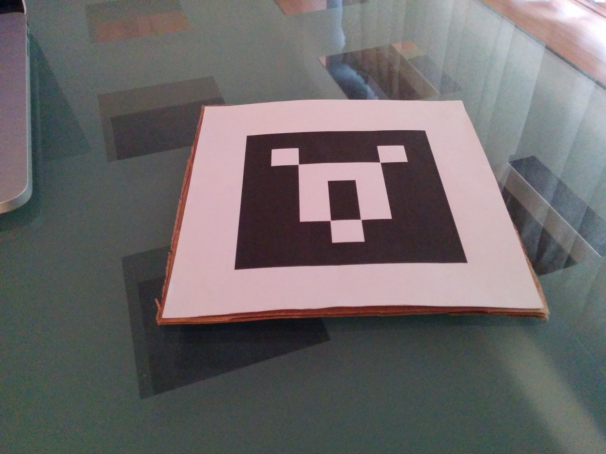

title: Augmented Reality in Three.js
output: index.html
--

# Integrate AR in Your Game

## By [@jerome_etienne](https://twitter.com/jerome_etienne)

---

### Wtf am i going to talk about ?

1. Intro on gaming and Augmented Reality
2. Present WebAR: an AR solution for the Web

---

## In Short...

---

### Challenges in Gaming and AR

- Works well for board/card games
- Everybody is looking
- No killer app game yet

There is an opportunity there!

---

### WebAR - a AR solution for the Web

- What is [WebAR](https://github.com/jeromeetienne/threex.webar)
- Only Web Technology + All Open Source
- Performance : Native vs Web ? Which should you pick ?

---

## Let's get started!

---

### Who Am I ?

- Best Known as the author of [Learning Three.js Blog](http://learningthreejs.com/)
- Wrote more than [45 game extensions for three.js](http://www.threejsgames.com/extensions/)
- Lead for Three.js Team at [Daqri](http://daqri.com) in Dublin

Contact me on twitter [@jerome_etienne](https://twitter.com/jerome_etienne)

---

# Challenge in Gaming and AR

---

### META

- META: integrate the talk from john
- His links
- Say 5-10 slides max
- With videos and screenshots via skitch

---

## How can this talk help ?

## Provide to the technical solution for you to experiment

---

## How 

---

### What Will I Talk About ?

- Doing Augmented Reality
- Using Only Web Technology
- Using Only Open Source

---

# The Challenge

---

## To Do Augmented Reality

## With Web Technology

## And Open Source

---

# A Good Recipe ?

---

## First, Let's See What We Need.

---

### Ingredients Needed For AR

1. Get a camera feed
1. Analyze it to localize AR Markers
1. Generate 3d on top
1. Finally display both, 3d and video, on the screen

---

## How To Do It With The Web ?

---

## With A Pinch of Web Standards

---

### Camera Feed

- Simple color video like Webcam
- webrtc/getUserMedia - [spec](http://www.w3.org/TR/mediacapture-streams/) - [example](http://simpl.info/getusermedia/)
- Supported on Desktop and Android mobile
- Not IOS unfortunatly - [details](http://caniuse.com/#feat=stream)

---

### Display 3D

- WebGL - [spec](https://www.khronos.org/registry/webgl/specs/latest/)
- Standard to display 3d on the web
- Based on openGL 2.0
- Available on desktop and modern mobile phones

---

### Usual Web Platform

- Javascript to code the app
- CSS to layout elements on the page

---

## The web contains all the Ingredients needed For Augmented Reality

---


## How far can we go ?

---

### Result

- We tried and it works!
- We have augmented reality in browsers.
- It EVEN runs in browser and mobile phones.
- All open source, so you can use it.

---

### Sample Code

- It is provided as sample code for you to build on
- Thus you focus on your own app
- Available on [github](https://github.com/jeromeetienne/arplayerforthreejs)

---

## Now Some Examples to Copy From

---

### Being Awesome - [link](images/screenshots/being-awesome.jpg)

- Attached a marker to my glass
- Used it as a marker
- May be the base for a shooting game
- People shooting at each other 

---

### Being Awesome - [link](images/screenshots/being-awesome.jpg)

<iframe width="640" height="480" src="https://www.youtube.com/embed/fz9bmOfYvG0" frameborder="0" allowfullscreen></iframe>

---

### Data Visualisation - [link](https://www.youtube.com/watch?v=wrMX_FH2hsc)

- Dynamic Histogram in AR on Mobile
- May be used to visualize property of a equipment e.g. microwave
- Documentation, Animated How To
- Give local info e.g. which tuning for a given recipe

---

### Data Visualisation - [link](https://www.youtube.com/watch?v=wrMX_FH2hsc)


<iframe src="https://vine.co/v/ei1TDWLrYiX/embed/simple" width="480" height="480" frameborder="0"></iframe>

---

### Contact Sharing in AR - [link](https://github.com/jeromeetienne/arplayerforthreejs/blob/master/examples/contact-sharing-in-ar.html)

- Display Info From a Database on per-marker basis
- Everybody in a conf has its own Marker
- They use the apps to recognize each other
- More efficient than swapping bizcards

---

### Contact Sharing in AR - [link](https://github.com/jeromeetienne/arplayerforthreejs/blob/master/examples/contact-sharing-in-ar.html)

<!--  -->

<iframe width="640" height="400" src="https://www.youtube.com/embed/wrMX_FH2hsc" frameborder="0" allowfullscreen></iframe>

---

## A classic Hatsune Miku

---

### Funny Joke - Hatsune Miku - [link](https://vine.co/v/eApD5rPtKxT)

- japanese META TO THAT HERE

---

### Funny Joke - Hatsune Miku - [link](https://vine.co/v/eApD5rPtKxT)

model by [@superhoge](https://twitter.com/superhoge)

<iframe src="https://vine.co/v/eApD5rPtKxT/embed/simple" width="480" height="480" frameborder="0"></iframe>

---


## How we implemented it

---

### A Spoon of Open Source

- [three.js](http://threejs.org/) to ease webgl display
- [jsaruco](https://github.com/jcmellado/js-aruco) to find AR markers within video streams


---

### Display WebGL

- Three.js javascript library from [mrdoob](https://twitter.com/mrdoob)
- Leading library to display Webgl
- MIT license, so easy to integrate
- Runs on desktop and mobile.

---

### AR Marker Recognition

Several possibilities, we focused on

- jsaruco - current implementation
- jsartoolkit - to be implemented

---

### js-aruco

>>> ArUco library is a minimal library for Augmented Reality
>>> applications based on OpenCv.

- js-aruco is a Javascript Port of [ArUco library](http://www.uco.es/investiga/grupos/ava/node/26).

---

### jsartoolkit

- Javascript port of [artoolkit](http://artoolkit.org) - Rather Old - 3 years old
- Written by [Ilmari Heikkinen](http://www.fhtr.net/)
- Available on [github](https://github.com/kig/JSARToolKit)
- To use it in this in the pipe

---

# Code Overview

---
### Extensions For Augmented Reality
- [threex.jsarucomarker.js](https://github.com/jeromeetienne/arplayerforthreejs/blob/master/src/threex.jsarucomarker.js) - marker recognition
- [threex.webcamgrabbing.js](https://github.com/jeromeetienne/arplayerforthreejs/blob/master/src/threex.webcamgrabbing.js) - video grabbing

See [README.md](https://github.com/jeromeetienne/arplayerforthreejs/blob/master/README.md) for Details

---

### Examples walk through

- can be found in ```/examples``` - [link](https://github.com/jeromeetienne/arplayerforthreejs/tree/master/examples)
- Good place to learn how to use the code
- Experiment with multiple type of applications

---

### basic.html


---

### basic.html

-  [source](https://github.com/jeromeetienne/arplayerforthreejs/blob/master/examples/basic.html) written to be simple and clear
- Good for getting started
- Display debug informations to ease understanding

---

### data-visualization-histogram3d.html


---

### data-visualization-histogram3d.html

- [source](https://github.com/jeromeetienne/arplayerforthreejs/blob/master/examples/data-visualization-histogram3d.html)
- Data visualisation with a 3d histogram
- Change the value the way you like
- Information source may be a REST API
- or from an industrial sensor

Up to you

---

### contact-sharing-in-ar.html

[link](https://www.youtube.com/watch?v=wrMX_FH2hsc)

<iframe width="640" height="480" src="https://www.youtube.com/embed/wrMX_FH2hsc" frameborder="0" allowfullscreen></iframe>

---

### contact-sharing-in-ar.html

- [source](https://github.com/jeromeetienne/arplayerforthreejs/blob/master/examples/contact-sharing-in-ar.html)
- Simple App to share contact in AR.
- Show informations on a per-marker basis.
- Informations are from database.

---

### contact-sharing-in-ar.html


<!-- TODO add a wine -->

---

# Markers

---

### Looks Like That


---

## Not too sexy but practical

---

### Markers Details

- Each got a given ID
- From 0 to 1023
- Simple to recognize many markers

---

### This One is 265


---

### How to Generate Other Markers

- Web app to automatically generate it
- Find it in [repo](http://jeromeetienne.github.io/arplayerforthreejs/marker/builder/iframe.html#265)
- It is using [aruco-marker](http://github.com/bhollis/aruco-marker)

---

# Markers (bis)

---

## They are the base

## Let's see how to handle them

---

### Display it on Mobile


---

### Display it on Mobile

- Load the image on your phone or tablet
- Put the mobile in front of the camera
- CON: mobile screens are reflective
- PRO: highly available

---

### Print It on Paper



---

### Print It on Paper

- CON: Requires a printer
- PRO: No/little reflection - so ease recognition
- So paper is usually better
- Glue it on cardboard for robustness

---

## All that seems nice !

---

## What about performance ?

---

# How Does Web Compare with Native ?

---

## Well it depends... :)

---

### PRO Web
- Lots less code to write
  - no need for android version + IOS version
- Easier to learn
  - More standard
  - Less Varied

---

### PRO Native
- Better controls on running platform
  - e.g. can't read webcam in IOS browser
  - but possible in IOS native
- More efficient
  - native typically runs faster
  - less latency
  - more battery life

---

### Choosing Between Native and Web

- It depends on your goals

- For serious, long term project, native may be better

- For fun, short project, go for web technology

---

## Whatever you choose, Native or Web

# The importance is to experience AR

---

## So now that we have all the ingredients

# Time to cook it up!

---

# To do AR is to work on the future

---

# Questions ?
