title: How To Make Games in THREE.js
author:
  name: "Jerome Etienne"
  twitter: "@jerome_etienne"
  url: "http://jetienne.com"
output: index.html

--

<style>pre { font-size: 90%; }</style>
<base target='_blank'>


# How To Make Games in THREE.js

## and having fun in the process :)

--

### Plan

* Creating an basic 3d object and animate it
* Build a Map with existing extensions
* How to add sounds in your games
* how to link your webgl with usual web content

--

### Plan (bis)

* Some Tricks from minigames
* What we could do soon in the future
* how to handle mobile

--

# Introduction
## THREE.js For Games

--

### What is THREE.js

* Display 3D graphics in Web Browser
* Effort led by [mrdoob](http://www.mrdoob.com/)
* Large community
* 100kbyte after gzip
* [homepage](http://threejs.org)

--

### General Presentations

* Focus on displaying 3d
* scene graph
* import assets from many file formats
* post processing
* Many renderers

**So Many Things Can't list them all**

--

### Many Renderers

* [WebGL renderer](http://threejs.org/examples/webgl_materials.html) - webgl direct rendering
* [WebGL deferred renderer](http://threejs.org/examples/webgldeferred_pointlights.html) - WebGL deffered rendering - Lot's more light
* [css3 renderer](http://threejs.org/examples/css3d_periodictable.html) - use css 3d transformation

--

### More Funky Renderers

* [canvas renderer](http://threejs.org/examples/canvas_materials.html) - to render in canvas2d
* [software renderer](http://threejs.org/examples/software_sandbox.html)
pure js drawing - 
  * pre GPU era - actual zbuffer
* [ascii renderer](http://threejs.org/examples/canvas_ascii_effect.html) - for live ascii art
* [Even a raytracer](http://alteredqualia.com/three/examples/raytracer_sandbox_reflection.html) - yeah you heard me
  * to be landed soon

--

## so only display ? 

--

## But game is more than that.

--

### THREE.js for Games

* use extensions and other libraries
* handle physics and collision
* handle sounds
* handle inputs
* handle effects
* etc...

**Packaged as THREEx Extensions**

--

### What is THREEx ?

* Ultra light extension system for [three.js](http://threejs.org)
* [threex](http://jeromeetienne.github.io/threex/) on github - 40 modules and counting

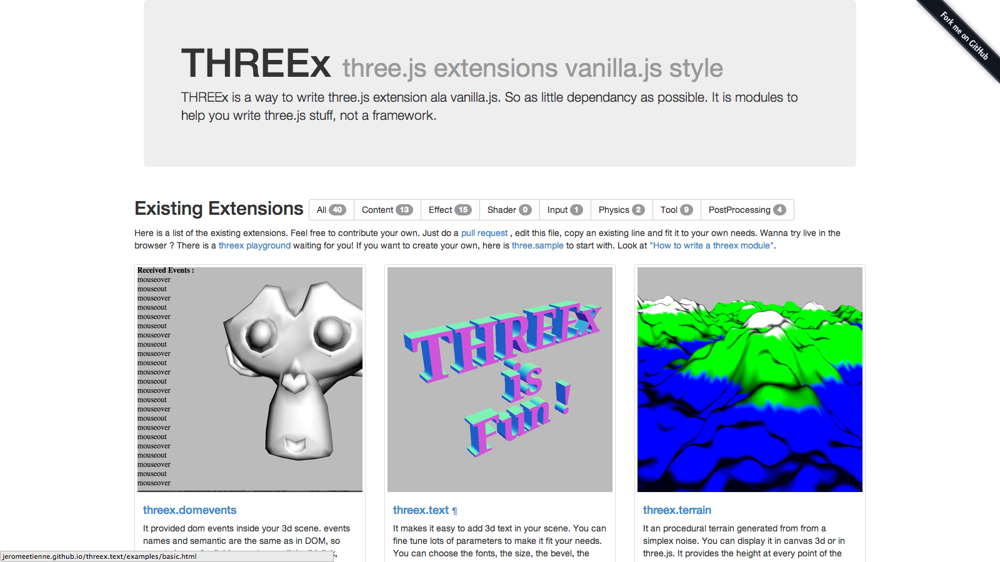

--

## Three.js seems ok... but

# How to make a game with it

--

## First we need a HERO

--

## In all game you need a hero

--

## A personna to embody you

--

## A virtual self for the player to interact with

--

## So lets do just that, lets create a hero

--

# New Part

--

# "A Hero is Born!"

## or How to Build Simple 3D Objects
--

### Lets Mold Our Hero

* We gonna go for something simple
* Very blocky 
* Very lego like
* We go for minecraft character


* (hint: trick because i dunno how to use a modeler :) )

--

## So Let's Start with a cube

--

### How to create a cube ?

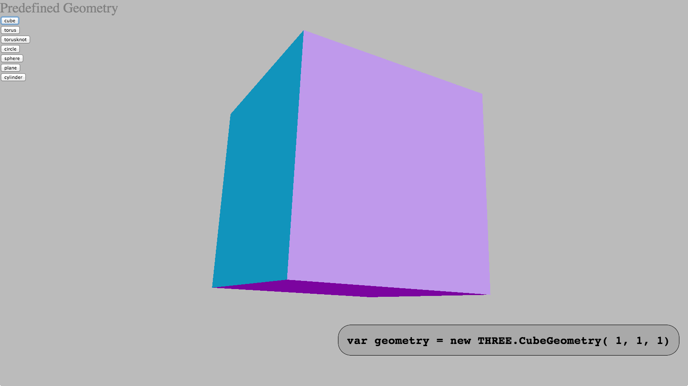

--

### How to create a cube ?

Here is the code

```
var geometry = new THREE.CubeGeometry(1,1,1)
var material = new THREE.MeshNormalMaterial()
var mesh     = new THREE.Mesh(geometry, material)
scene.add(mesh)
```

--

### First the Geometry

* Geometry is ```the shape of the object```
* create a cube with dimension 1,1,1

```
var geometry = new THREE.CubeGeometry(1,1,1)
```

```
var material = new THREE.MeshNormalMaterial()
var mesh     = new THREE.Mesh(geometry, material)
scene.add(mesh)
```

--

### Other Predefined Geometry

[demo](demos/geometryselect/)

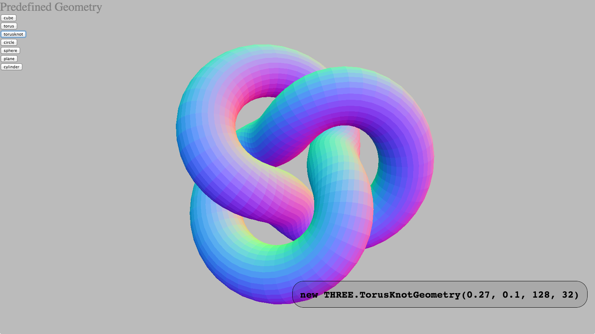

--

### Then Materials

"How the object reflect lights"

* Basic
* Lambert
* Phong 
* Custom Shader

--

## Well it is just a cube...

--

### We Needs A Hero!

* Duplication same principle
* Cubes for everything


--

### Hot or NOT

[demo](demos/hotornot/)

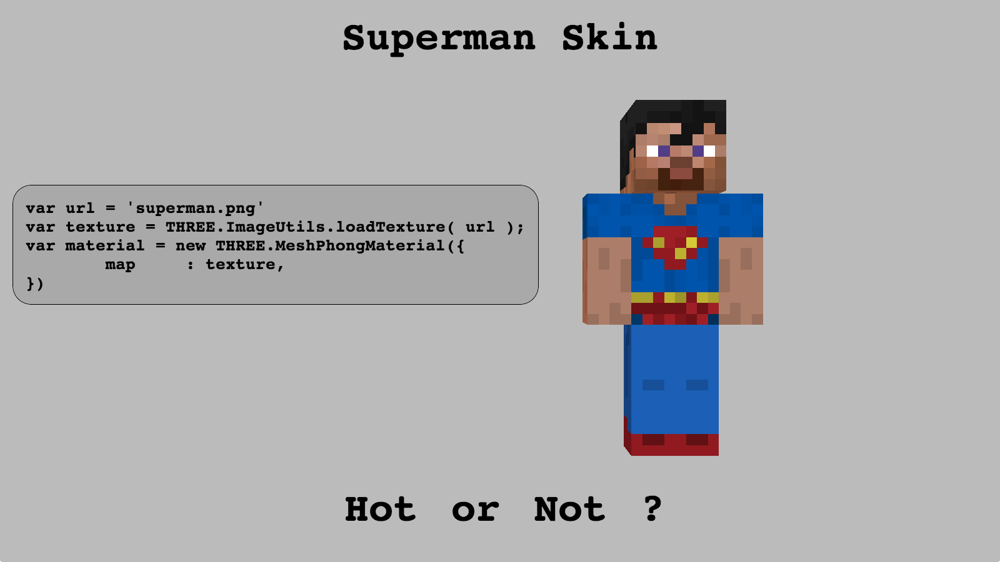

--

### "All persons fictitious"

[disclaimer](http://en.wikipedia.org/wiki/All_persons_fictitious_disclaimer)

> "All characters appearing in this work are fictitious. 
>  Any resemblance to real persons, living or dead, 
>  is purely coincidental."

--

### Almost :)

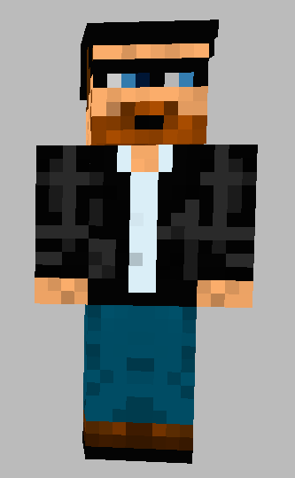


--

## I love the recursive jokes.

--

## Cool we got a player

--

## He needs more life

--

## He needs to move

--

### Player Animations

[demo](http://jeromeetienne.github.io/threex/src/threex.minecraft/examples/animation.html)

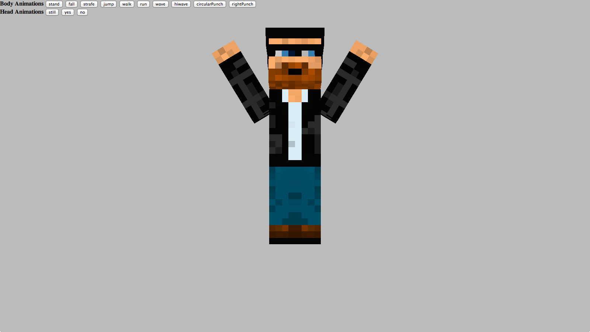

--

## He is Alive!

--

## He is Gollem. My Frankenstein.

--

## What have I done! 

--

## Oh damn! Turing was right! 

--

## Now he is aware. 

--

# His name is Mike.

--

## He needs a purpose, a goal, a quest

--

## He is looking for **love**, **fame** and **justice**

--

## because that is what every video game hero is doing :)

--

## Now that we got the player 

--

## we need a map to move in

--

## a world where we can evolve

--

## a world where Mike can become a man

--

## a new man

--

## a better man!

--

# New Part

--

# "Mike Needs a World"

## or How to use THREEx Games Extensions

--

### Demo Time!

[link](demos/mike-map)

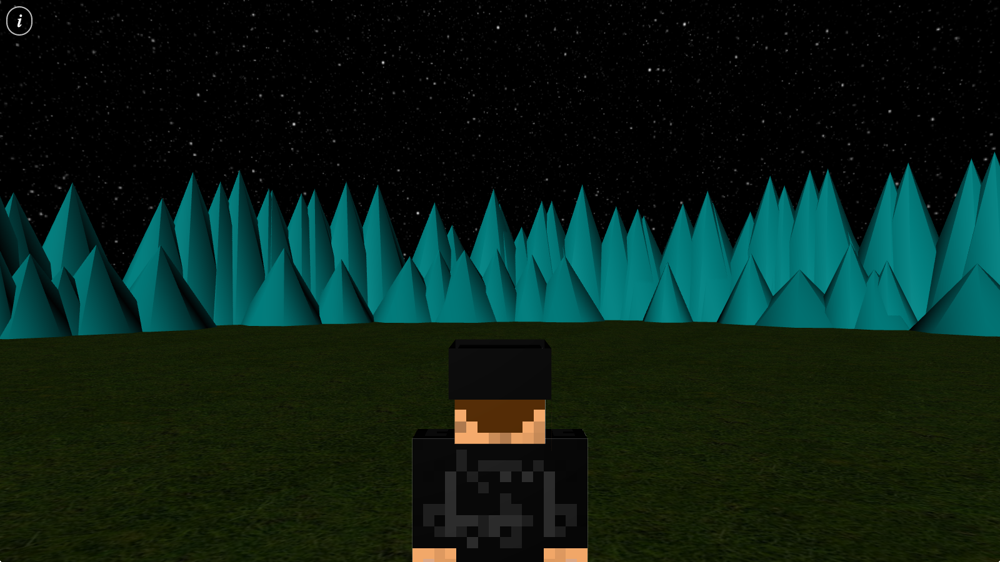

--

### Used Extensions 

* [threex.grassground](https://github.com/jeromeetienne/threex.grassground) - for the ground
* [threex.montainsarena](https://github.com/jeromeetienne/threex.montainsarena) - to put montains around us
* [threex.daynight](https://github.com/jeromeetienne/threex.daynight) - to fill the sky and see time passing 


**List of [all Extensions](http://jeromeetienne.github.io/threex/)**

--

### What is THREEx ?

* light extension system ala [vanilla.js](http://vanilla-js.com/)
* as little dependancy as possible
* not a framework, 
* more a [bunch of convention](http://jeromeetienne.github.io/threex/www/how-to-write-a-threex-module.html)
* DRY modules to help you write three.js stuff

--

### THREEx Workflow

* support modern web workflow
* Support [bower](http://bower.io/) for install
* Support [require.js](http://requirejs.org/) for include
* Even support [yeoman](http://yeoman.io) for boilerplates

### DO NOT REQUIRE IT

* this is the trick :)

--

### Packages - install manual

* find the repository and copy the files
* no handling for dependancy

--

### Packages - install with bower

* homepage [bower](http://bower.io)
* effort led by [twitter](http://twitter.com)

--

### Packages - install with bower

To install

```
bower install threex.planets
```

To search for more

```
bower search threex
```

--

### Packages - include manual

* include all ```.js``` with a ```<script>```
* may need to init some variables
  * e.g. ```.baseUrl``` for asset location
* js minification is on yoou

--

### Packages - include with require.js

* just require the ```package.require.js``` file
* it does a bunch of things for you
  * includes all ```.js```
  * setup asset location
  * handle js minification 

--

## Now we got principles, lets see some extensions

--

### Used Extensions 

* [threex.grassground](https://github.com/jeromeetienne/threex.grassground) - for the ground
* [threex.montainsarena](https://github.com/jeromeetienne/threex.montainsarena) - to put montains around us
* [threex.daynight](https://github.com/jeromeetienne/threex.daynight) - to fill the sky and see time passing 

--

### Grass Ground

threex.grassground - 
[repo](https://github.com/jeromeetienne/threex.grassground)
[demo](http://jeromeetienne.github.io/threex.grassground/examples/basic.html)


--

### threex.grassground

Install it

```
bower install threex.grassground
```

Include it

```
 <script src='threex.grassground.js'></script>
```

Use it

```
var groundMesh  = new THREEx.GrassGround()
scene.add(groundMesh)
```

--

### Perlin Terrain ?

threex.terrain - 
[repo](https://github.com/jeromeetienne/threex.terrain)
[demo](http://jeromeetienne.github.io/threex.terrain/examples/minecraft.html)

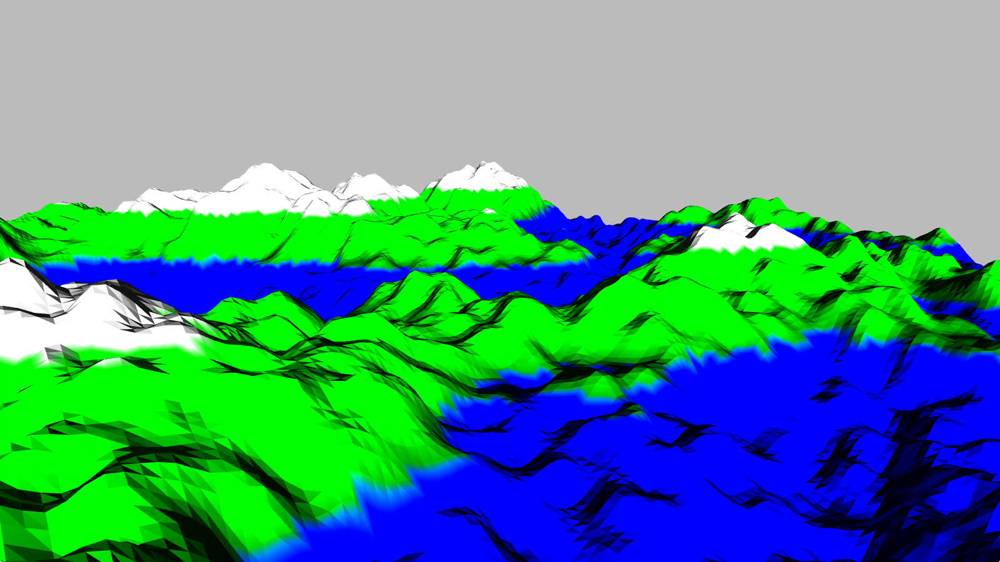

--

### Montain Arena

threex.montainsarena - 
[repo](https://github.com/jeromeetienne/threex.montainsarena)
[demo](http://jeromeetienne.github.io/threex.montainsarena/examples/basic.html)


--

### threex.montainsarena

include it

```
 <script src='threex.montainsarena.js'></script>
```

Use it

```
var mesh    = new THREEx.MontainsArena()
scene.add(mesh)
```
--

### Day And Night

threex.daynight - 
[repo](https://github.com/jeromeetienne/threex.daynight)
[demo](http://jeromeetienne.github.io/threex.daynight/examples/basic.html)


--

### threex.daynight

include it

```
 <script src='threex.daynight.js'></script>
```

Use it

```
var sunLight    = new THREEx.DayNight.SunLight()
scene.add( sunLight.object3d )
```

Update it

```
sunLight.update(sunAngle)
```

--

# Physics

--

### Physics and Three.js

* not in three.js itself
* realtime 3d physics is **HARD**
* It is a project in itself

### Principles 

* keep them separate 
* but interact well with it

--

### Current Alternatives

* [oimo.js](http://lo-th.github.io/Oimo.js/) by [lo-th](https://github.com/lo-th)
* [cannon.js](http://cannonjs.org/) by [schteppe](https://twitter.com/schteppe)
* [ammo.js](https://github.com/kripken/ammo.js/) from wellknown [bullet](http://bulletphysics.org/wordpress/)

--

### oimo.js

[demo](http://lo-th.github.io/Oimo.js/) by [lo-th](https://github.com/lo-th)

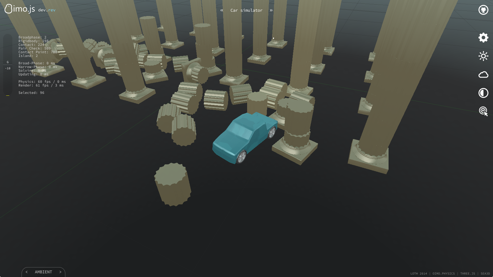

--

### cannon.js

[homepage](http://cannonjs.org/)  by [schteppe](https://twitter.com/schteppe)
/ [demo](http://schteppe.github.io/cannon.js/examples/threejs_fps.html)
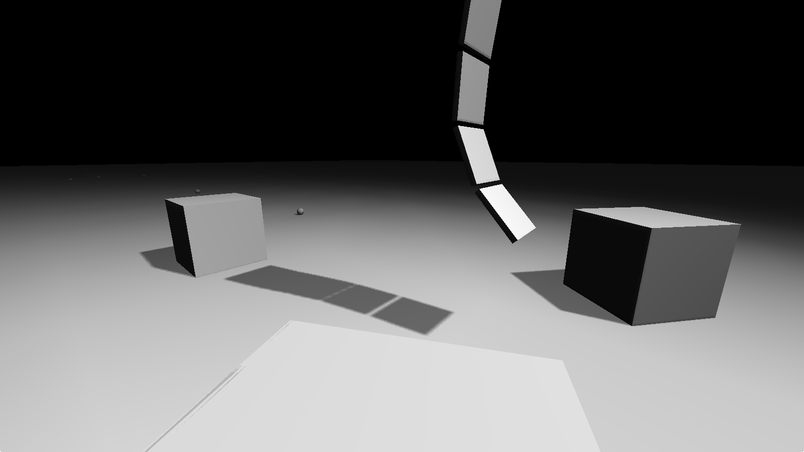

--

### ammo.js

[homepage](https://github.com/kripken/ammo.js/) by [Alon Zakai](https://github.com/kripken) /
[demo](http://alteredqualia.com/xg/examples/animation_physics_level.html) by 
[alteredq](http://alteredqualia.com/)

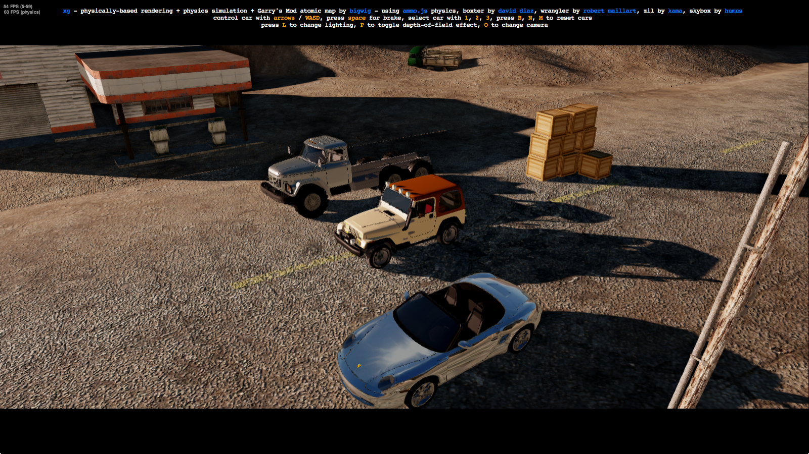

--

### three.js and cannon.js

[repo](https://github.com/jeromeetienne/threex.cannonjs)
/ [demo](http://jeromeetienne.github.io/threex.cannonjs/examples/domino.html)

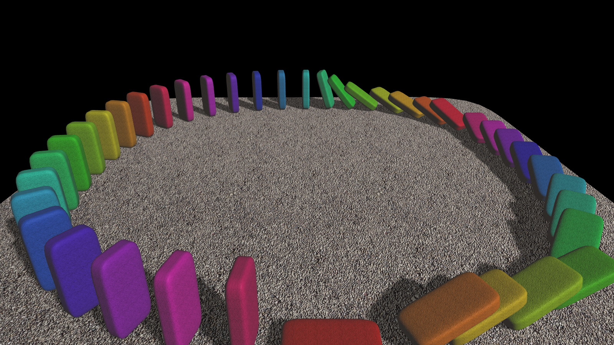


--

### three.js and oimo.js

[repo](https://github.com/jeromeetienne/threex.oimo)
/ [demo](http://jeromeetienne.github.io/threex.oimo/examples/demo.html)
/ [demo crates](http://jeromeetienne.github.io/threex.oimo/examples/crates.html)

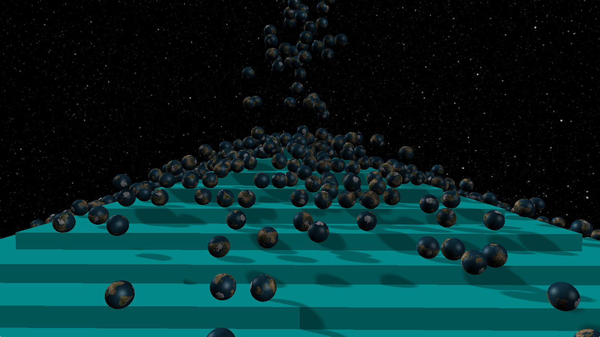

--

# New Part

--

# "Mike Goes Party"

## or how to add sounds in your games

--

### Demo Time

[demo](demos/party)

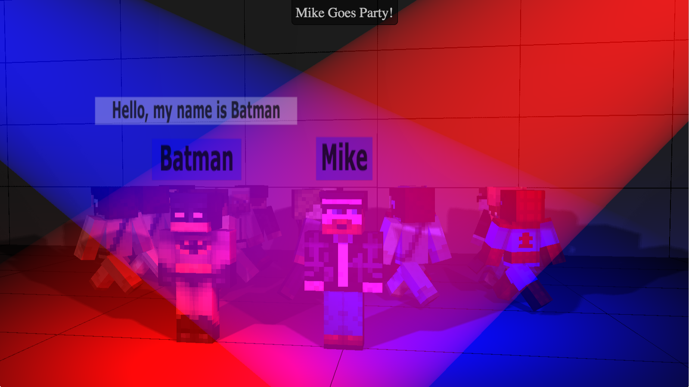

--

### Web Audio API

* New Sound API - Aimed for game
* Based on OpenAL - So Rather complex

### Features
* sound localisation
* Dopler
* convolver
* Great Accuracy - no latency
* very little cpu consumption

--

## Maybe a little helper could helps

--

### webaudiox.gamesounds

* make Web Audio Api easy to use for gamedevs
* provide the typical cases
* no need to understand the whole Web Audio API

### How to get it
* webaudiox on [github](https://github.com/jeromeetienne/webaudiox)
* or via ```bower install webaudiox```
--

### Basic Usage

Initialize sound context

```
var gameSounds  = new WebAudiox.GameSounds()
```

Load the Sound

```
gameSounds.createSound().load('mysound.ogg', function(sound){
    // here the sound is loaded
})
```

Play it

```
sound.play();
```

--

### Sound Localisation - Good For 3D

Set the listener as player object3d

```
gameSounds.listenerFollow(object3d)
```

Play Sound at a given position in space

```
gamesound.play({
  follow  : explosionMesh
})
```

--

# New Part

--

# "Mike Goes Home And Play Video Games"

## or how to link your webgl with usual web content

--

### Demo Time!

[demo](http://jetienne.com/games/)

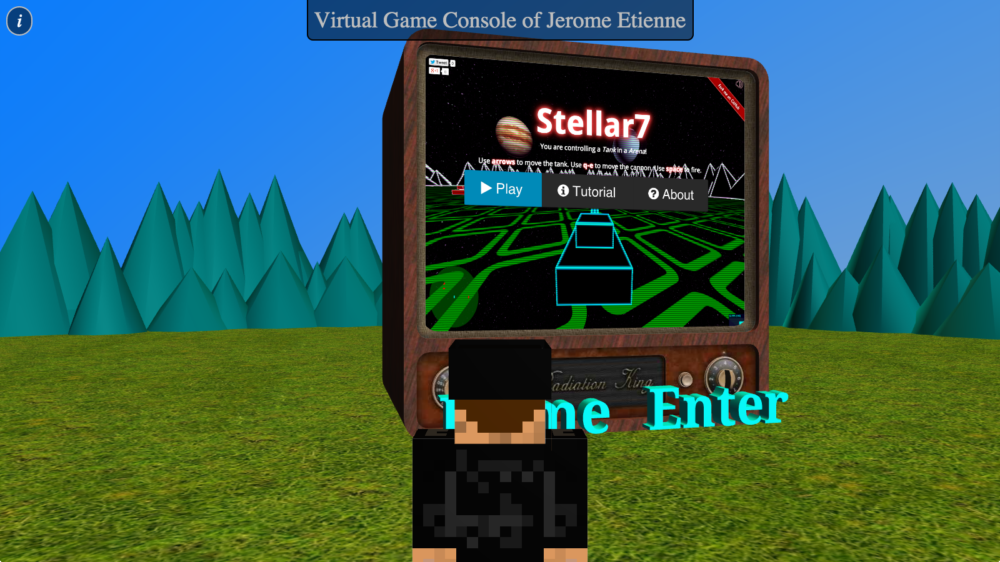

--

## Nice! How the tv set is done ?


--

### Display actual web content

* able to seamlessly display web content in webgl

### Contains mouse events on 3d events

* player able to interact with 3d elements


### The whole shebang

--

### threex.text.js

[repo](https://github.com/jeromeetienne/threex.text) - [demo](http://jeromeetienne.github.io/threex.text/examples/basic.html)


--

### threex.text.js

Install it

```
bower install threex.text
```

Use it

```
var mesh    = new THREEx.Text('THREEx')
scene.add(mesh)
```

--

### threex.domevents.js

[repo](https://github.com/jeromeetienne/threex.domevents) - [demo](http://jeromeetienne.github.io/threex.domevents/examples/basic.html)


--

### threex.domevents.js

Install it

```
bower install threex.domevents
```

Init it

```
var domEvents   = new THREEx.DomEvents(camera)
```

Bind ```click``` event on a mesh

```
domEvents.addEventListener(mesh, 'click', function(){
    console.log('you clicked on the mesh')
}, false)
```


--

### threex.htmlmixer.js

[repo](https://github.com/jeromeetienne/threex.htmlmixer)
/ [demo](http://jeromeetienne.github.io/threex.htmlmixer/examples/basic.html)
/ [post](http://learningthreejs.com/blog/2013/04/30/closing-the-gap-between-html-and-webgl/)
/ [videobrowser](http://jeromeetienne.github.io/videobrowser4learningthreejs)


--

### threex.htmlmixer.js

Initialize it

```
var mixerContext    = new THREEx.HtmlMixer.Context(renderer, scene, camera)
onRenderFcts.push(function(delta, now){
    mixerContext.update(delta, now)
})
```

Use it on a domElement - typically an iframe

```
var mixerPlane  = new THREEx.HtmlMixer.Plane(mixerContext, domElement)
scene.add(mixerPlane.object3d)
```

--

### Meta

* goto portfolio games
  * use directly this demo
* do some story telling
* and then switch to the tech part

--

### Meta Story Telling

* here is a virtual game console
* you can play games inside a game
* you got a menu with all the games
* if you go close to the TV, the camera becomes centered on the tv and you can enjoy your play
* but still the actual games is going on around us
* see with the day night cycle

--

* ok so which game to play ?
* Lets see pong, this is classic
* or marble table, actual physics cannonjs, granular sound, play with camera
* or Let's play with a friend
  * launch mmo3d
  * multiplayer game 
  * demo it. run on nodejitsu. they got a "if it is opensource, we run it for free"
* or simply stellar7
  Another classic

--

### How to include webpage like that ?

* Meta html mixer [threex.htmlmixer](https://github.com/jeromeetienne/threex.htmlmixer)
  [demo](http://jeromeetienne.github.io/videobrowser4learningthreejs/)
  [post](http://learningthreejs.com/blog/2013/04/30/closing-the-gap-between-html-and-webgl/)
* Meta domEvenr repo [threex.domevents](https://github.com/jeromeetienne/threex.domevents)
  [post](http://learningthreejs.com/blog/2012/01/17/dom-events-in-3d-space/)
* take it from the blog
  * ["Mixing HTML Pages Inside Your WebGL"](http://learningthreejs.com/blog/2013/04/30/closing-the-gap-between-html-and-webgl/)

--

## What about Those Mini Games ?

--

### MiniGame - PongGL

[link](http://jeromeetienne.github.io/pongGL/)

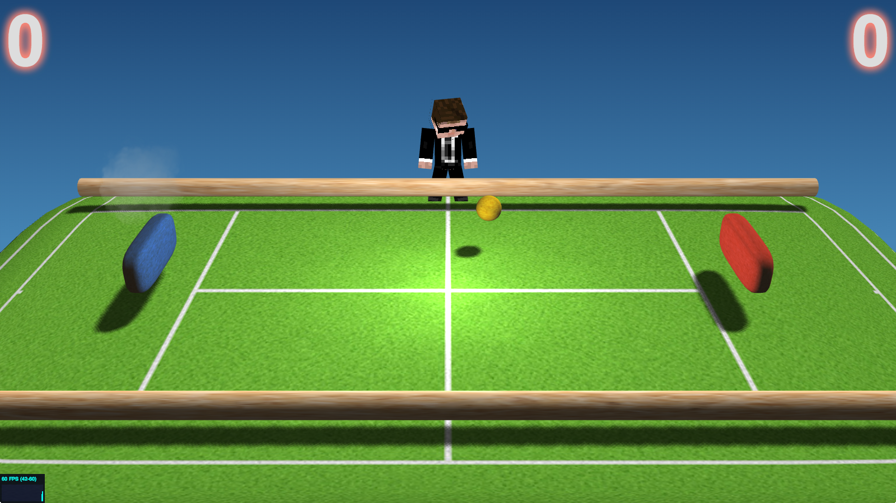

--

### MiniGame - PongGL

* Racket + ground with [Catmull–Clark subdivision surface](http://en.wikipedia.org/wiki/Catmull%E2%80%93Clark_subdivision_surface)
[demo](http://threejs.org/examples/webgl_geometry_subdivision.html)
* Minecraft looking at the ball
* Particles for smoke on impact
* WebAudiox for sound

--

### MiniGame - Marble Table

[link](http://jeromeetienne.github.io/marbleTable/)

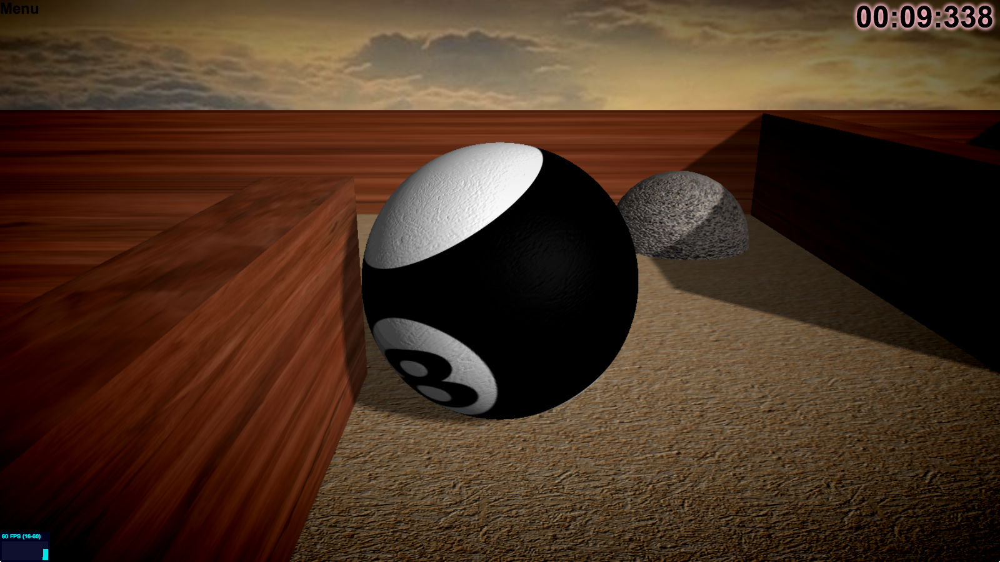

--

### MiniGame - Marble Table

* granular sound with Web Audio API - [webaudiox](https://github.com/jeromeetienne/webaudiox)
* Add skymap - [threex.skymap](https://github.com/jeromeetienne/threex.skymap)
* Handle keyboard input - [threex.keyboardstate](https://github.com/jeromeetienne/threex.keyboardstate)

--

### MiniGame - Stellar7

[link](http://jeromeetienne.github.io/stellar7/)

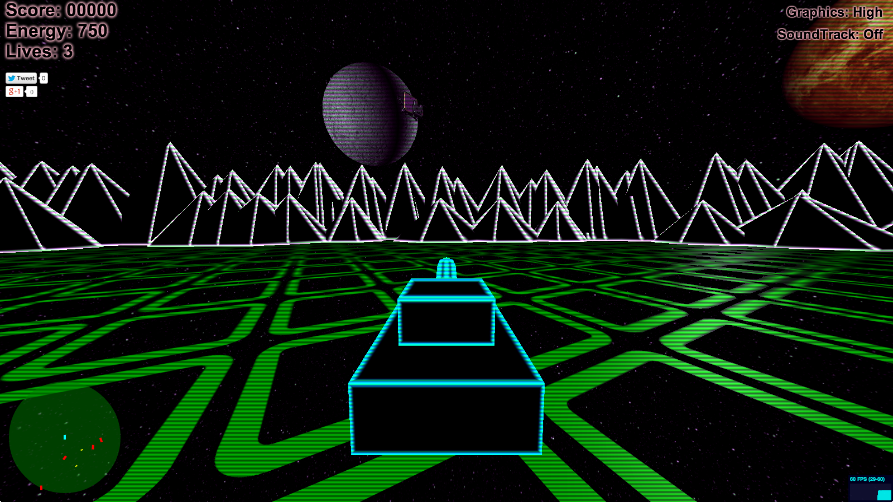

--

### MiniGame - Stellar7

* color adjust post processing - [threex.coloradjust](https://github.com/jeromeetienne/threex.coloradjust)
* bad tv effect post processing - [threex.badtvpproc](https://github.com/jeromeetienne/threex.badtvpproc)
* solid wireframe - [threex.solidwireframe](https://github.com/jeromeetienne/threex.solidwireframe)
* Planets - [threex.planets](https://github.com/jeromeetienne/threex.planets)
* NyanCat - [threex.nyancat](https://github.com/jeromeetienne/threex.nyancat)

--

# New Part

--

# "Mike Thinks about Diana"

--

### META Storytelling: 

* After playing video games, 
* Mike gets tired and he starts to daydream
* "What would be the best video game for me?"
* "I am young and full of energy"
* "I like games and i lack girls"
* He wants to create a girl for himself 
* A Game where people could find their match
* Here is what is in mike head

--

### Here is Diana

[demo](http://lo-th.github.io/olympe/index_diana.html)

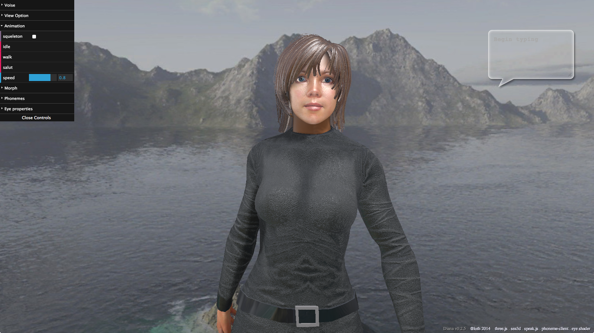

--

### Diana's Avatar

* top notch avatar all in three.js

--

### Diana's Eyes

[demo](http://vill.ee/eye/) - by [Artur Vill](https://twitter.com/shaderology)

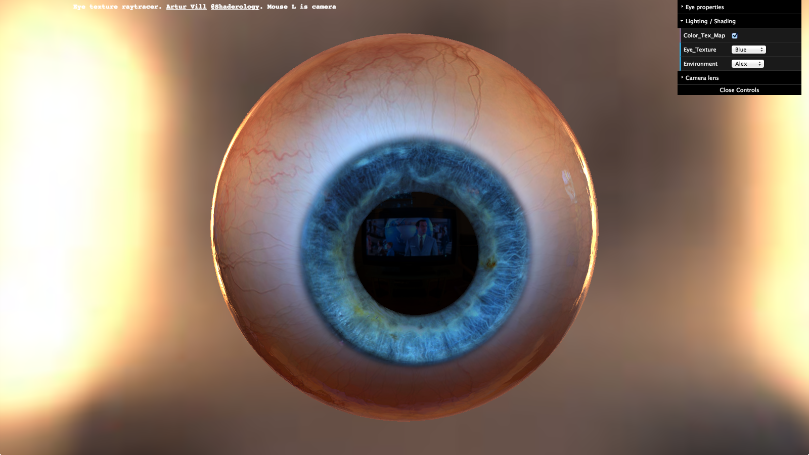

--

### Diana's Eyes

* Very realistic
* All in custom Shaders
* Quite Sexy
  * the designer wasnt thinking about his gramma

--

### META tech

* Detailler chaque element technique de cette demo
* then extend to the possibility of what could it be


--

* It is already very nice avatar
* What could it be ?
* What if we improve how we interact with this virtual world
* Make it a better experience. a more immersive experience
* 
* occulus drift to get better depth perception
  * or similar
* leap motion as game input
  * more natural move
  * more instinctive
* suppose on top of that you
* with leap motion, occulus drift
  * [three.js occulus drift)(http://threejs.org/examples/webgl_effects_oculusrift.html)
  * [hand with leap motion](http://blog.romanliutikov.com/post/60899246643/manipulating-rigged-hand-with-leap-motion-in-three-js)
  * [youtube video](https://www.youtube.com/watch?v=1LHBlY9go7M)
* multiplayer with webrtc
* [Simulated reality](http://en.wikipedia.org/wiki/Simulated_reality)

--

### Occulus drift ?

* [homepage](http://www.oculusvr.com/) - [John Carmack as CTO](http://www.oculusvr.com/blog/john-carmack-joins-oculus-as-cto/) - [300usd](https://www.oculusvr.com/order/)


--

### Already Available in THREE.js

[link](http://threejs.org/examples/webgl_effects_oculusrift.html)

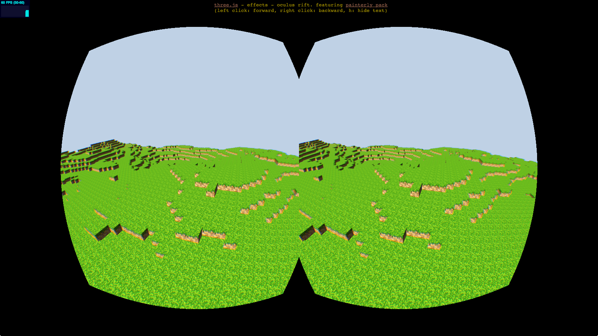

--

## What if i don't want Occulus Drift ?

--

### Alternatives - anaglyph

[demo](http://threejs.org/examples/webgl_effects_anaglyph)

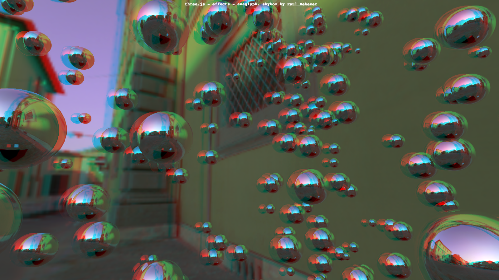</a>

--

### Alternatives - crosseyed

[demo](http://threejs.org/examples/webgl_effects_crosseyed)

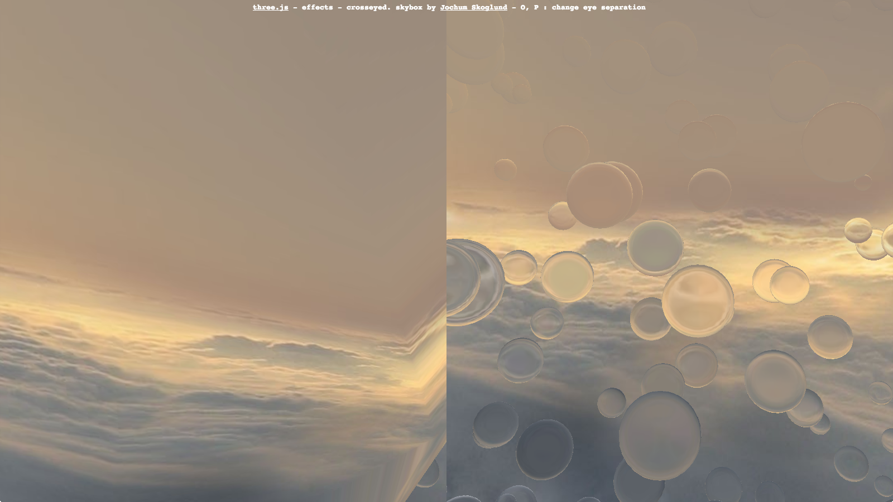</a>

--

### Alternatives - parallaxbarrier

[demo](http://threejs.org/examples/webgl_effects_parallaxbarrier)

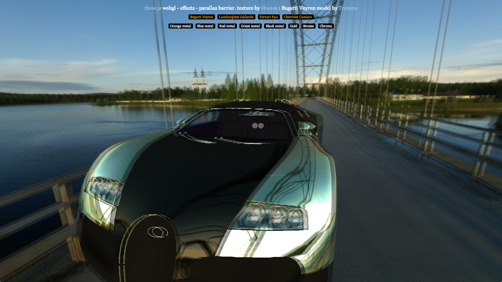</a>

--

## How to interact with this virtual world ?

--

### Leap Motion Device

* [leapjs](https://github.com/leapmotion/leapjs) - JavaScript client for the Leap Motion Controller
* [100euro](https://leapmotion.com/)

--

### WebRTC

* live audio/video conferencing
  * open standard
* p2p so cheap to run
  * and reduce privacy issues


--

## Now mike is in love

--

## He can't stop thinking about diana

--

## He want to share every moment of his life

--

## Even when he is on the go

--

# New Part

--

# "Mike wants Diana on his Mobile"

## or WebGL on mobile

--

### Mobile Inputs

* on desktop, keyboard and mouse
* on mobile, touch screen


**ALL UI is Changed**

--

### virtualjoystick.js

[repo](https://github.com/jeromeetienne/virtualjoystick.js)
/ [demo](http://jeromeetienne.github.io/virtualjoystick.js/examples/basic.html)
/ [post](http://learningthreejs.com/blog/2011/12/26/let-s-make-a-3d-game-virtual-joystick/)

--

### WebGL Support on Mobile

* not widely supported yet...
* not all OS
* great difference between devices

**Not Easy Yet**

--

### THREE.js Games Mobile

* [stellar7](http://jeromeetienne.github.io/stellar7/) WebGL clone from the old game
* [mmo3d](http://mmo3d.jit.su) multiplayer game

**Works on Mobile**

--

## What if my device doesn't support WebGL ?

--

# Cloud Gaming ?
## To save the day

--

### What are we gonna talk about ?

* Possible solution for cloud gaming
* apply to any webgl games
  * not only three.js ones
* cheap idea for cloud gaming for webgl

**status** : experimental, naive but working surprisingly well!

--

### Demo Time

Youtube video [here](http://www.youtube.com/watch?v=yTSXLyg1uu8)

<iframe width="560" height="315" src="//www.youtube.com/embed/fHVfy7WrPH0" frameborder="0" allowfullscreen></iframe>

--

### What is Cloud Gaming ?

* [wikipedia](http://en.wikipedia.org/wiki/Cloud_gaming) definition
* It is new. no widely accepted definition
* usually implies **render on server** feature

Rougly…

```
Trying to run a game written for device A
on a device B, typically dumber than A.
```

--

## What it is for us ?

--

### Our Goal

* To display a webgl game 
* on a non-webgl player mobil device

**Simple Enough...**

--

# Early Study

## For Early Prototype

--

### Early Study - Rendering

* So we got to render our game in server
* it will be **rendered via a web browser**
* seems natural choise to render webgl

--

### Early Study - Architechture

3 parts 

* **a renderer :** the brower running our game
* **a controller :** used by players to access our game
* **a server :** ensures the communication between both

--

### Early Study - Networking

* networking done thru websocket
* no webrtc at the moment
* websocket is available a lot more than webrtc
* especially on mobile phone, our usecase.

--

### Early Study - Software

* server in node.js
* websocket are trivial with socket.io
* little js library in renderer, and another in controller
* only common technology here

**implementation is easy**

--

## Looks Good… 

## What Would it be in Action ?
--

# Theory Of Operations

--

### Theory Of Operations - Server


* a renderer browser web running the game
* take regular screenshots with [.toDataUrl()](https://developer.mozilla.org/en/docs/Web/API/HTMLCanvasElement#Methods)
* Send them to the player device via echo server 
  * mobile phone, tablette whatever.

--

### Theory Of Operations - Player

* player can see webgl rendering on any device
* player uses touch screen as inputs
* inputs are then sent to the server 
* server send them back to the renderer.

--

### Theory Of Operations - Output

* browser receives inputs from the player.
* player sees what is displayed in the browser.

**we got the whole loop**

--

### Theory Of Operations - Results

* This is actual cloud gaming! 
* Simple implementation
* Less than 24h to write!

--

### Performances

* left as an exercice to the reader :)
* Depends about too many factors
  * screen resolution, screen size
  * network bandwidth, network latency
  * servers cost

**On Wifi, i had 30fps ymmv**

--

# Last Part

--

# "Mike Concludes His Talk"

--

* We have seen what three.js could do for Games
* we createa a player
* a map for him to move in
* showed how to handle sounds in 3d env with Web Audio API
* we show various alternative to handle physics


